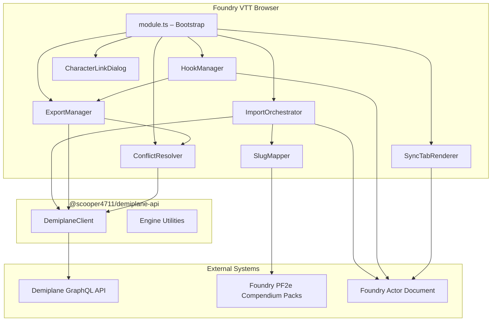
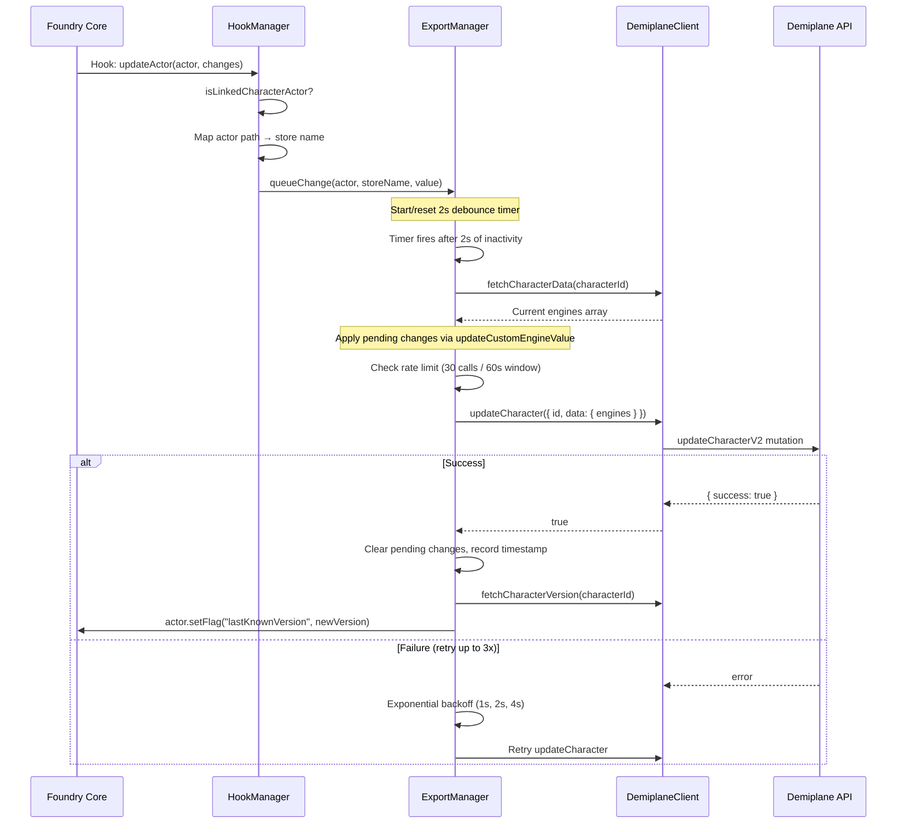
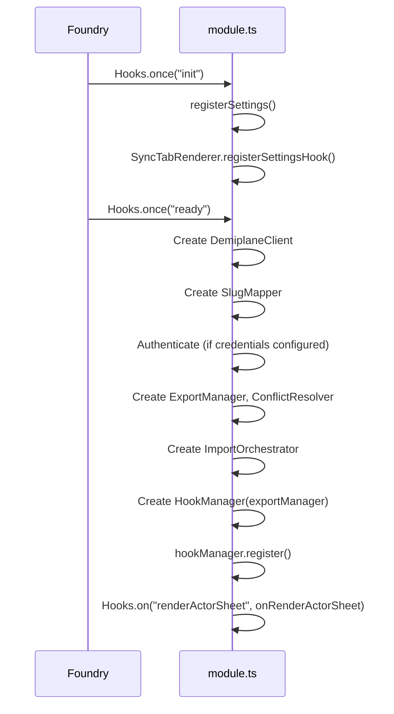

# Architecture

This document describes the internal architecture of `foundry-demiplane-pf2e`, covering data flow, hook lifecycle, slug mapping rules, and Grant Chain sequencing.

## Component Diagram



## Import Data Flow

**Direction:** Demiplane API → DemiplaneClient → ImportOrchestrator → SlugMapper → Actor

```mermaid
sequenceDiagram
    participant User
    participant SyncTab as SyncTabRenderer
    participant IO as ImportOrchestrator
    participant DC as DemiplaneClient
    participant SM as SlugMapper
    participant Comp as Compendium Packs
    participant Actor

    User->>SyncTab: Click "Import from Demiplane"
    SyncTab->>IO: importCharacter(actor, characterId, options)
    IO->>DC: fetchCharacterData(characterId)
    DC-->>IO: { engines: CharacterEngine[] }

    Note over IO: Extract name, level from Custom_Engines

    loop For each DemiplaneEngine with a slug
        IO->>SM: resolve(demiplaneSlug)
        SM->>SM: transformSlug (strip "-rm" suffix)
        SM->>Comp: Search packs by system.slug
        Comp-->>SM: ResolvedItem { uuid, packKey, slug }
        SM-->>IO: ResolvedItem or undefined
    end

    Note over IO: Reconcile stale items (delete previously imported)

    IO->>Actor: update({ name, level })
    IO->>Actor: deleteEmbeddedDocuments("Item", staleIds)

    Note over IO: Sequential: ancestry → heritage → background → class
    IO->>Actor: createEmbeddedDocuments("Item", [ancestry])
    IO->>Actor: createEmbeddedDocuments("Item", [heritage])
    IO->>Actor: createEmbeddedDocuments("Item", [background])
    IO->>Actor: createEmbeddedDocuments("Item", [class])

    Note over IO: Batch: feats + class features + equipment + spells
    IO->>Actor: createEmbeddedDocuments("Item", batchItems)

    Note over IO: Apply session state (HP, currency, hero points, focus)
    IO->>Actor: update(sessionStateValues)

    IO->>DC: fetchCharacterVersion(characterId)
    IO->>Actor: setFlag("lastKnownVersion", version)
    IO->>Actor: setFlag("lastSyncTimestamp", now)
    IO-->>SyncTab: ImportSummary
```

### Import Steps Summary

1. **Fetch** — `DemiplaneClient.fetchCharacterData` retrieves the full engines array via GraphQL.
2. **Extract identity** — Character name and level come from Custom_Engine entries (`character_name`, `character_level`).
3. **Resolve slugs** — Each DemiplaneEngine's `args.slug` is passed through `SlugMapper.resolve` to find the Foundry compendium UUID.
4. **Reconcile** — Items flagged `foundry-demiplane-pf2e.imported = true` are deleted to prevent duplicates.
5. **Sequential add** — Ancestry, heritage, background, class are added one at a time (Grant Chain requirement).
6. **Batch add** — Feats, class features, equipment, and spells are added in a single call.
7. **Session state** — HP, temp HP, hero points, focus points, and currency are written to the actor.
8. **Version stamp** — The remote version number and timestamp are stored in actor flags for conflict detection.

## Export Data Flow

**Direction:** Actor → HookManager → ExportManager → DemiplaneClient → Demiplane API



## Hook Lifecycle

`HookManager` registers four Foundry hooks during module initialization (`Hooks.once("ready")`). All hooks only process actors that are `type: "character"` and have a linked Demiplane character UUID stored in flags.

| Hook | Handler | What It Detects | Action |
|------|---------|----------------|--------|
| `updateActor` | `onActorUpdate` | Changes to HP, temp HP, hero points, focus points, or currency fields | Maps the changed actor path to a Demiplane store name and calls `ExportManager.queueChange` |
| `updateItem` | `onItemUpdate` | Consumable quantity changes on items owned by a linked actor | Logs the quantity change (future: export consumable tracking) |
| `createItem` | `onItemCreate` | New item added to a linked actor | Logs the item creation (future: equipment sync) |
| `deleteItem` | `onItemDelete` | Item removed from a linked actor | Logs the item deletion (future: equipment sync) |

### Actor Field Mappings

The `updateActor` hook uses a static mapping to translate Foundry data paths into Demiplane store names:

| Foundry Actor Path | Demiplane Store Name |
|---|---|
| `system.attributes.hp.value` | `character_hit-points_current` |
| `system.attributes.hp.temp` | `character_hit-points_temp` |
| `system.resources.heroPoints.value` | `character_hero-points` |
| `system.resources.focus.value` | `character_focus_current` |
| `system.currency.gp` | `character_currency_gold` |
| `system.currency.sp` | `character_currency_silver` |
| `system.currency.cp` | `character_currency_copper` |
| `system.currency.pp` | `character_currency_platinum` |

### Debounce and Rate-Limit Integration

```
Actor change → HookManager.onActorUpdate
  → ExportManager.queueChange (stores change, resets 2s timer)
  → [2 seconds of inactivity]
  → ExportManager.flush
      ├─ Rate limit check: ≤30 calls per 60s rolling window per character
      ├─ Fetch current engines from Demiplane
      ├─ Apply all queued changes immutably
      └─ Push via updateCharacterV2 (retry up to 3x with exponential backoff)
```

- **Debounce window:** 2 seconds. Each new change resets the timer, so rapid changes (e.g., HP loss in combat) coalesce into a single API call.
- **Rate limit:** 30 API calls per 60-second rolling window per character. If exceeded, the flush returns an error and retains pending changes.
- **Retry:** Failed pushes retry up to 3 times with exponential backoff (1s → 2s → 4s). After exhaustion, a `ui.notifications.error` is displayed and changes remain queued.

## SlugMapper

### Transformation Rules

1. **Strip `-rm` suffix** — Demiplane uses the `-rm` suffix to denote Pathfinder 2e Remastered content. The Foundry PF2e system uses the same items for both legacy and remastered, so the suffix is stripped:
   - `"fireball-rm"` → `"fireball"`
   - `"fighter"` → `"fighter"` (no change)

2. **Pass-through** — Slugs without the `-rm` suffix are used as-is for the compendium lookup.

### Compendium Search Order

The mapper searches the following packs in order, returning the first match:

| Priority | Pack Key | Contents |
|----------|----------|----------|
| 1 | `pf2e.classes` | Class items |
| 2 | `pf2e.ancestries` | Ancestry items |
| 3 | `pf2e.heritages` | Heritage items |
| 4 | `pf2e.backgrounds` | Background items |
| 5 | `pf2e.feats-srd` | Feats |
| 6 | `pf2e.spells-srd` | Spells |
| 7 | `pf2e.equipment-srd` | Equipment, armor, weapons |
| 8 | `pf2e.classfeatures` | Class features |

### Duplicate Handling

When multiple compendium entries share the same `system.slug`, the mapper uses the first match found in pack search order and logs an info-level message identifying the duplicate. This handles edge cases where items appear in multiple packs.

### Failure Handling

When no match is found across all searched packs, the mapper returns `undefined` and logs a warning with:
- The original Demiplane slug
- The derived Foundry slug
- The list of packs that were searched

The caller (ImportOrchestrator) increments `itemsSkipped` and continues the import.

## Grant Chain Sequencing

The PF2e system uses a Grant Chain — when certain items are added to an actor, the system automatically grants related features (e.g., adding a class grants its class features at the appropriate level). This imposes ordering constraints on import.

### Sequential Phase

These categories must be added one at a time, waiting for each `createEmbeddedDocuments` call to complete before the next:

```
ancestry → heritage → background → class
```

**Why this order matters:**
- **Ancestry** grants ancestry features, ability boosts, HP, size, speed, and senses.
- **Heritage** grants heritage-specific features (requires ancestry to be present).
- **Background** grants trained skills and a skill feat (may reference ancestry traits).
- **Class** grants class features, proficiencies, key ability, and class DC (the most feature-rich grant).

Each call triggers the PF2e Grant Chain internally, which adds sub-items. These must resolve before the next category is added so prerequisites are satisfied.

### Batch Phase

After the sequential phase completes, these categories are added in a single `createEmbeddedDocuments` call:

- Feats
- Class features (additional, beyond those auto-granted by class)
- Equipment
- Spells

These items don't have inter-dependencies that require ordering, so batching them improves performance.

### Engine Categorization

The `ImportOrchestrator` categorizes each DemiplaneEngine by inspecting its `name` field path:

| Path Segment | Category |
|---|---|
| `/classfeature/` or `/class-feature/` | classfeature |
| `/ancestry/` | ancestry |
| `/heritage/` | heritage |
| `/background/` | background |
| `/class/` | class |
| `/feat/` | feat |
| `/spell/` | spell |
| `/equipment/`, `/armor/`, `/weapon/` | equipment |

Note: `/classfeature/` is checked before `/class/` to prevent false categorization of class feature engines as class engines.

## Module Initialization



## Conflict Detection

Before pushing changes, the ExportManager checks whether the remote character version exceeds the locally stored version:

1. Actor flag `lastKnownVersion` holds the version from the last successful sync.
2. `fetchCharacterVersion` retrieves the current remote version.
3. If `remote > local`, a conflict is detected.

Resolution options (presented in the Sync tab):
- **Re-import** — Fetch fresh remote data, overlay local session state, push merged result.
- **Force push** — Overwrite remote with local engines array.
- **Cancel** — Abort; retain pending changes for next attempt.
