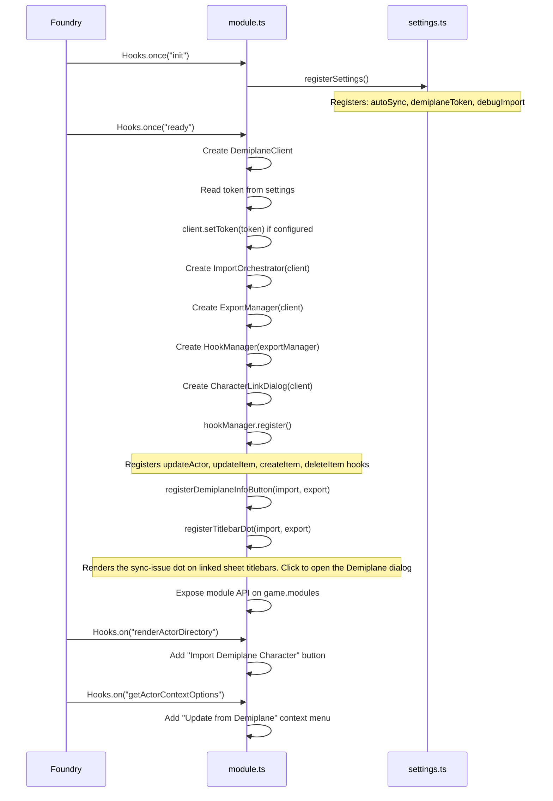
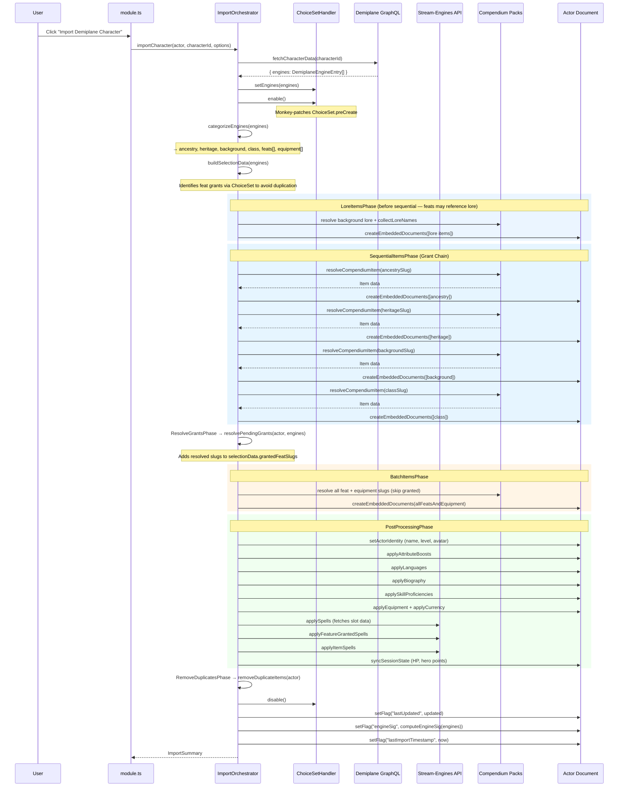
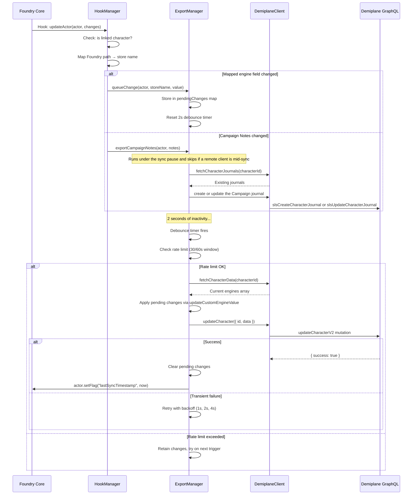
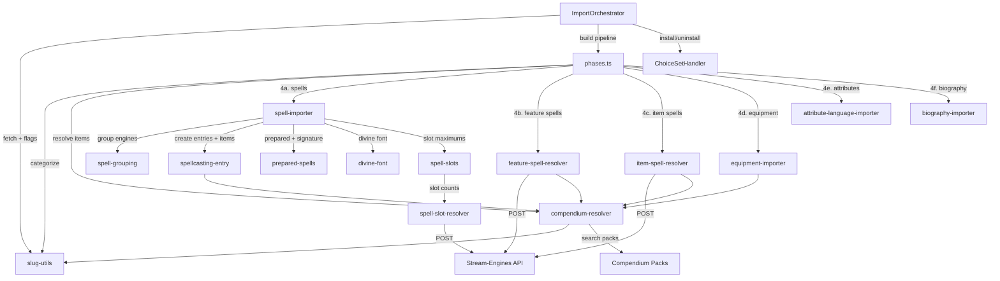
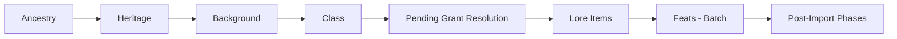

# Architecture

This document describes the internal architecture of `demiplane-pf2e`: component responsibilities, class relationships, data flow through the system, and lifecycle hooks.

---

## Table of Contents

- [Component Overview](#component-overview)
- [Class Diagram](#class-diagram)
- [Module Initialization](#module-initialization)
- [Import Data Flow](#import-data-flow)
- [Export Data Flow](#export-data-flow)
- [Conflict Detection Flow](#conflict-detection-flow)
- [File Structure](#file-structure)
- [Import Subsystem Detail](#import-subsystem-detail)
- [Hook Lifecycle](#hook-lifecycle)
- [Compendium Resolution](#compendium-resolution)
- [ChoiceSet Auto-Resolution](#choiceset-auto-resolution)
- [Grant Chain Sequencing](#grant-chain-sequencing)

---

## Component Overview

```mermaid
graph TD
    subgraph "Foundry VTT Browser"
        Module["module.ts<br/>Bootstrap + Hook Registration"]
        Settings["settings.ts<br/>Module Settings"]
        ST["titlebar-dot.ts<br/>Sync Issue Indicator"]
        SI["sync-issues.ts<br/>Import/Export Issue Sets"]
        IBTN["demiplane-info-button.ts<br/>Demiplane Dialog"]
        CLD["CharacterLinkDialog<br/>UUID Linking"]
        HM["HookManager<br/>Actor Change Detection"]
        IO["ImportOrchestrator<br/>Import Pipeline Driver"]
        EM["ExportManager<br/>Push Orchestration"]
        CB["ChangeBuffer<br/>Queue + Debounce + Rate Limit"]
        PB["PushPayloadBuilder<br/>Build Payload"]
        CR["ConflictResolver<br/>Optimistic Concurrency"]
    end

    subgraph "Import Subsystem"
        CSH["ChoiceSetHandler<br/>Auto-Select Choices"]
        CompRes["compendium-resolver<br/>Slug → UUID"]
        SlugUtils["slug-utils<br/>Slug Transformation"]
        SpellImp["spell-importer<br/>Spellcasting Entries"]
        SpellSlot["spell-slot-resolver<br/>Slot Progression"]
        FeatSpell["feature-spell-resolver<br/>Focus/Innate Spells"]
        ItemSpell["item-spell-resolver<br/>Staff/Wand Spells"]
        EquipImp["equipment-importer<br/>Items + Containers"]
        AttrImp["attribute-language-importer<br/>Boosts + Skills + Languages"]
        BioImp["biography-importer<br/>Bio Fields + Deity"]
        Phases["phases.ts<br/>ImportPhase Pipeline"]
    end

    subgraph "@scooper4711/demiplane-api"
        DC[DemiplaneClient]
        EU[Engine Utilities]
    end

    subgraph "External APIs"
        GQL["Demiplane GraphQL<br/>apiv4.demiplane.com"]
        SE["Stream-Engines<br/>character.demiplane.com"]
    end

    subgraph "Foundry Core"
        ACTOR[Actor Document]
        COMP[Compendium Packs]
        HOOKS[Foundry Hook System]
    end

    Module --> Settings
    Module --> HM
    Module --> IO
    Module --> EM
    Module --> ST
    Module --> CLD

    HM --> EM
    EM --> CB
    EM --> PB
    EM --> CR
    EM --> DC
    DC --> GQL

    IO --> CSH
    IO --> CompRes
    IO --> SlugUtils
    IO --> SpellImp
    IO --> EquipImp
    IO --> AttrImp
    IO --> BioImp
    IO --> ACTOR

    SpellImp --> SpellSlot
    SpellImp --> CompRes
    SpellSlot --> SE
    FeatSpell --> SE
    FeatSpell --> CompRes
    ItemSpell --> SE
    ItemSpell --> CompRes
    CompRes --> SlugUtils
    CompRes --> COMP

    IO --> FeatSpell
    IO --> ItemSpell
    IO --> Phases
    Phases --> CSH
    Phases --> CompRes
    Phases --> SpellImp
    Phases --> EquipImp
    Phases --> AttrImp
    Phases --> BioImp

    ST --> ACTOR
    CLD --> ACTOR
    HOOKS --> HM
    HOOKS --> Module
```



---

## Class Diagram

```mermaid
classDiagram
    class DemiplaneClient {
        -graphqlToken: string|null
        +setToken(token: string): void
        +isAuthenticated(): boolean
        +validateToken(): Promise~void~
        +fetchCharacterData(id: string): Promise~CharacterData~
        +fetchCharacterVersion(id: string): Promise~CharacterVersion~
        +fetchAttributeMapping(nexusId: number): Promise~AttributeMapping~
        +updateCharacter(options: UpdateCharacterOptions): Promise~boolean~
    }

    class ImportOrchestrator {
        -choiceSetHandler: ChoiceSetHandler
        -client: DemiplaneClient
        +importCharacter(actor, characterId, options): Promise~ImportSummary~
        -fetchCharacterEngines(characterId, token, summary): Promise~(engines, updated)|null~
        -importJournals(actor, characterId): Promise~void~
        -buildPipeline(): ImportPhase[]
    }

    class ImportPhase {
        <<interface>>
        +run(actor, ctx: ImportContext): Promise~void~
    }

    class ImportContext {
        +engines: DemiplaneEngineEntry[]
        +summary: ImportSummary
        +choiceSetHandler: ChoiceSetHandler
        +categorized: CategorizedEngines
        +selectionData: (grantedFeatSlugs, selectedFeats)
        +grantResolvedSlugs: Set~string~
    }

    class LoreItemsPhase {
        +run(actor, ctx): Promise~void~
    }
    class SequentialItemsPhase {
        +run(actor, ctx): Promise~void~
    }
    class ResolveGrantsPhase {
        +run(actor, ctx): Promise~void~
    }
    class BatchItemsPhase {
        +run(actor, ctx): Promise~void~
    }
    class PostProcessingPhase {
        +run(actor, ctx): Promise~void~
    }
    class RemoveDuplicatesPhase {
        +run(actor, ctx): Promise~void~
    }

    ImportOrchestrator --> ImportPhase : drives in order
    ImportPhase <|.. LoreItemsPhase
    ImportPhase <|.. SequentialItemsPhase
    ImportPhase <|.. ResolveGrantsPhase
    ImportPhase <|.. BatchItemsPhase
    ImportPhase <|.. PostProcessingPhase
    ImportPhase <|.. RemoveDuplicatesPhase
    ImportContext ..> ImportPhase : passed to run()

    class ExportManager {
        -client: DemiplaneClient
        -changeBuffer: ChangeBuffer
        -payloadBuilder: PushPayloadBuilder
        -conflictResolver: ConflictResolver
        +setOnConflictHandler(handler): void
        +queueChange(actor, field, value): void
        +queueItemChange(actor, itemSlug, demiplaneSlug, changeType, value, itemType?, edited?): void
        +queueItemDelete(actor, slot): void
        +exportCampaignNotes(actor, notes): Promise~void~
        +flush(actor): Promise~ExportResult~
        +suspend(characterId): void
        +resume(characterId): void
        +getPendingChanges(characterId): PendingChange[]
        +hasPendingChanges(characterId): boolean
    }

    class ChangeBuffer {
        -pendingChanges: Map~string, Map~string, PendingChange~~
        -pendingItemChanges: Map~string, Map~string, PendingItemChange~~
        -debounceTimers: Map~string, number~
        -apiCallTimestamps: Map~string, number[]~
        -suspendCounts: Map~string, number~
        +queueChange(actor, field, value): void
        +queueItemChange(actor, itemSlug, demiplaneSlug, changeType, value, itemType?, edited?): void
        +queueItemDelete(actor, slot): void
        +suspend(characterId): void
        +resume(characterId): void
        +peek(characterId): PendingMaps
        +clear(characterId): void
        +isWithinRateLimit(characterId): boolean
        +recordApiCall(characterId): void
        +getPendingChanges(characterId): PendingChange[]
        +hasPendingChanges(characterId): boolean
    }

    class PushPayloadBuilder {
        -client: DemiplaneClient
        +buildUpdatedCharacterData(characterId, actor, changes, itemChanges): Promise~FetchedCharacter|null~
        -applyFieldChanges(engines, changes): CustomEngine[]
        -createOverrideEngine(name, value): CustomEngine
        -resolveItemChanges(fetched, itemChanges): ResolvedItemChange[]
        -applyItemChangeEngines(engines, resolved, actor): CustomEngine[]
        -applyItemDelete(engines, itemChange, demiplaneId): CustomEngine[]
        -applyEquippedEngine(engines, itemChange, demiplaneId): CustomEngine[]
        -applyHandSlotAssignment(engines, resolved): CustomEngine[]
    }

    class ConflictResolver {
        -client: DemiplaneClient
        +checkConflict(characterId, actor): Promise~ConflictCheckResult~
        -isRemoteContentChanged(characterId, actor): Promise~boolean~
    }

    class HookManager {
        -exportManager: ExportManager
        +register(): void
        -onActorUpdate(actor, changes): void
        -onItemUpdate(item, changes): void
        -onItemCreate(item): void
        -onItemDelete(item): void
        -mapFieldToStoreName(path): string|undefined
    }

    class TitlebarDot {
        +register(importCharacter, exportCharacter): void
        -applyDot(dot, actor): void
        -getOpenSheetsFor(actor): ActorSheet[]
    }

    class SyncIssues {
        +getImportIssues(actor): Set
        +getExportIssues(actor): Set
        +hasActiveIssues(actor): boolean
        +resetImportIssues(actor): void
        +clearExportIssues(actor): void
        +clearAllIssues(actor): void
        +addImportIssue(actor, msg): void
        +addExportIssue(actor, msg): void
    }

    class DemiplaneInfoDialog {
        +showDemiplaneInfoDialog(actor, id, import, export): Promise
        -buildIssuesSection(importIssues, exportIssues): string
        -buildManualItemsSection(items): string
        -performUpdate(actor, id, import): Promise
    }

    class CharacterLinkDialog {
        -client: DemiplaneClient
        +show(actor): void
        -linkCharacter(actor, input): Promise~void~
        -unlinkCharacter(actor): Promise~void~
    }

    class ChoiceSetHandler {
        -engines: DemiplaneEngineEntry[]
        +setEngines(engines): void
        +presetChoiceSelections(itemData): void
        +enable(): void
        +disable(): void
        -handlePreCreate(context, params): Promise~void~
        -findChoiceSelection(parentSlug, rule): Promise~string|null~
        -resolveChildSlug(rawSlug, rule, eng?): Promise~string|null~
    }

    class ChoiceMatchers {
        <<module>>
        +findMatchInChoices(choices, engines, itemName?): Choice|null
    }

    class SpellSlotResolver {
        +resolveSpellSlots(engineId, level, slotSlug): Promise~SpellSlotProgression~
    }

    class FeatureSpellResolver {
        +applyFeatureGrantedSpells(actor, engines, level): Promise~void~
    }

    class ItemSpellResolver {
        +applyItemSpells(actor, engines): Promise~void~
    }

    ImportOrchestrator --> DemiplaneClient : fetches data
    ImportOrchestrator --> ChoiceSetHandler : auto-resolves choices
    ChoiceSetHandler --> ChoiceMatchers : delegates strategy matching
    ImportOrchestrator --> SpellSlotResolver : spell slots
    ImportOrchestrator --> FeatureSpellResolver : focus/innate
    ImportOrchestrator --> ItemSpellResolver : staff/wand

    ExportManager --> ChangeBuffer : buffers changes
    ExportManager --> PushPayloadBuilder : builds payload
    ExportManager --> ConflictResolver : conflict check
    ExportManager --> DemiplaneClient : pushes changes
    HookManager --> ExportManager : queues changes

    SyncIssues ..> ExportManager : export issues
    SyncIssues ..> ImportOrchestrator : import issues
    DemiplaneInfoDialog --> SyncIssues : lists/acknowledges
    TitlebarDot --> SyncIssues : reads unacknowledged state
    TitlebarDot --> DemiplaneInfoDialog : opens on click
    CharacterLinkDialog --> DemiplaneClient : validates UUID
```



---

## Module Initialization



**Module API** (exposed on `game.modules.get("demiplane-pf2e").api`):

| Method                            | Description                 |
| --------------------------------- | --------------------------- |
| `importCharacter(actor, options)` | Trigger a full import       |
| `exportNow(actor)`                | Force-flush pending changes |

---

## Import Data Flow



---

## Export Data Flow



---

## File Structure

```
src/
├── module.ts                      Entry point: hook registration, service wiring, API exposure
├── settings.ts                    Foundry module settings (token, autoSync, debugImport)
├── hook-manager.ts                Listens to actor/item hooks, maps fields, queues exports
├── export-manager.ts              Push orchestration: flush flow, retry/backoff, wires collaborators
├── export/
│   ├── change-buffer.ts           Per-character pending change buffer: queue, debounce, rate limit, suspend
│   ├── push-payload-builder.ts    Builds the Demiplane character payload from buffered changes
│   └── conflict-resolver.ts       Optimistic-concurrency check (fetchCharacterUpdated + engineSig)
├── sync-pause.ts                  Cross-client sync coordination (pauses pushes during import/push)
├── sync-issues.ts                Import/export issue sets + unmapped slugs, with an acknowledged flag driving the indicator
├── titlebar-dot.ts               Red indicator on actor sheet titlebars for unacknowledged sync issues
├── demiplane-info-button.ts      Header button + Demiplane dialog (Sync issues vs Unmapped items; dismiss acknowledges)
├── character-link-dialog.ts       Dialog for linking/unlinking UUID to actor
├── character-link-input.ts        Parses UUID or Demiplane URL
│
├── import/
│   ├── index.ts                   Barrel re-export
│   ├── types.ts                   Core types: DemiplaneEngineEntry, ImportSummary, etc.
│   ├── orchestrator.ts            Thin import driver; builds + runs the phase pipeline
│   ├── phases.ts                  ImportPhase interface, ImportContext, and phase implementations
│   ├── slug-utils.ts              Slug transformation and categorization
│   ├── compendium-resolver.ts     Slug → compendium UUID resolution
│   ├── choice-set-handler.ts      ChoiceSet monkey-patch lifecycle + preset selections
│   ├── choice-matchers.ts         The 7 ChoiceSet match strategies (pure functions)
│   ├── choice-set-types.ts        ChoiceSet context/param interfaces
│   ├── choice-slug.ts             Shared label → slug normalization
│   ├── debug-log.ts               Conditional debug logging
│   │
│   ├── spell-importer.ts          Class spellcasting orchestration (grouping → entries → placement)
│   ├── spell-grouping.ts          Sorts spell engines into main/innate/font groups + class config
│   ├── spellcasting-entry.ts      Entry creation + shared resolve-and-stamp spell-item helper
│   ├── prepared-spells.ts         Prepared-slot placement + signature spell marking
│   ├── divine-font.ts             Cleric Divine Font spellcasting entry
│   ├── spell-slots.ts             Slot-maximum resolution + character level lookup
│   ├── spell-engines.ts           Spell engine identification helpers
│   ├── spell-slot-resolver.ts     Fetches slot progression from stream-engines
│   ├── feature-spell-resolver.ts  Focus/innate spells from class features
│   ├── item-spell-resolver.ts     Staff/wand spells from items
│   │
│   ├── equipment-importer.ts      Equipment + containers + carry state
│   ├── attribute-language-importer.ts  Boosts, skills, languages
│   └── biography-importer.ts      Biography fields, deity, organized play
│
└── pf2e-foundry-config.d.ts       Type augmentations for Foundry/PF2e
```

---

## Import Subsystem Detail

The import subsystem is the most complex part of the module. Here is how its components interact:



### Import Phase Order

| Phase | Component               | What It Does                                                                                              |
| ----- | ----------------------- | --------------------------------------------------------------------------------------------------------- |
| 1     | `ImportOrchestrator`    | Fetch engines, stamp `lastUpdated`/`engineSig` flags                                                      |
| 2     | `ChoiceSetHandler`      | Install monkey-patch for auto-selection                                                                   |
| 3     | `LoreItemsPhase`        | Create lore items (must precede ancestry/class)                                                           |
| 4     | `SequentialItemsPhase`  | Sequential: ancestry → heritage → background → class                                                      |
| 5     | `ResolveGrantsPhase`    | Resolve pending native grants; exclude from batch                                                         |
| 6     | `BatchItemsPhase`       | Batch: all feats + equipment                                                                              |
| 7     | `PostProcessingPhase`   | Identity, boosts, skills, languages, bio, equipment, currency, spells, feature/item spells, session state |
| 8     | `RemoveDuplicatesPhase` | Remove import-stamped duplicates of native grants                                                         |
| 9     | `ChoiceSetHandler`      | Uninstall monkey-patch                                                                                    |
| 10    | `ImportOrchestrator`    | Stamp `lastImportTimestamp` flag                                                                          |
| 11    | `ImportOrchestrator`    | Import "Campaign" journal → `biography.campaignNotes` (needs no monkey-patch; runs after uninstall)       |

The `ImportPhase` pipeline steps (3–8) are implemented in `src/import/phases.ts`
and driven in order by `ImportOrchestrator.importCharacter` inside its
`try/finally`. Each phase receives an `ImportContext` carrying the fetched
`engines`, the `ImportSummary`, the `ChoiceSetHandler`, the categorized engines,
the selection data, and the resolved-grant slugs.

---

## Hook Lifecycle

`HookManager` registers four Foundry hooks during initialization:

| Hook          | Trigger                        | Action                                                                        |
| ------------- | ------------------------------ | ----------------------------------------------------------------------------- |
| `updateActor` | Actor data changes             | Maps field path → Demiplane store name, queues export (skipped while syncing) |
| `updateItem`  | Item on linked actor changes   | Queues item change (skipped while syncing)                                    |
| `createItem`  | Item added to linked actor     | Logs creation (skipped while syncing)                                         |
| `deleteItem`  | Item removed from linked actor | Queues deletion (skipped while syncing)                                       |

All hooks filter for: `actor.type === "character"` AND actor has `demiplane-pf2e.characterId` flag set. **While any client has an in-flight import or push for the character** (the `demiplane-pf2e.syncActiveTokens` actor flag is non-empty), the hooks suppress queueing so a sync's replicated actor updates don't echo back to Demiplane. See `sync-pause.ts` and DESIGN §16.

### Actor Field → Store Name Mapping

| Foundry Actor Path                  | Demiplane Store Name           |
| ----------------------------------- | ------------------------------ |
| `system.attributes.hp.value`        | `character_hit-points_current` |
| `system.attributes.hp.temp`         | `character_hit-points_temp`    |
| `system.resources.heroPoints.value` | `character_hero-points`        |
| `system.resources.focus.value`      | `character_focus_current`      |
| `system.currency.gp`                | `character_currency_gold`      |
| `system.currency.sp`                | `character_currency_silver`    |
| `system.currency.cp`                | `character_currency_copper`    |
| `system.currency.pp`                | `character_currency_platinum`  |

---

## Compendium Resolution

The `compendium-resolver` module resolves a Demiplane slug to a Foundry item, checking the GM/recorded mapping first and otherwise searching PF2e compendium packs by `system.slug`.

### Resolution Algorithm

```
Input: Demiplane slug (e.g., "weapon-specialization-fighter-rm")

0. Mapping first: resolveMappedItem() returns the recorded/GM mapping if present
   (a mapping whose target is gone returns null, so resolution falls through).
1. Transform: toFoundrySlug() strips "-rm" suffix → "weapon-specialization-fighter"
2. Generate candidates:
   a. Exact: "weapon-specialization-fighter"
   b. Strip class suffix: "weapon-specialization"
   c. Bloodline prefix: "bloodline-weapon-specialization-fighter" (if applicable)
3. For each candidate, search target pack(s) by system.slug
4. On match: record it via recordResolvedMapping() so the next lookup hits the
   mapping first and the editor can show it, then return the item.
5. Return null if no candidate matches (slug recorded as unmapped).
```

Recording is non-clobbering — an existing GM override or prior recording is left
as-is — so it never changes what resolves, only caches the outcome. See
[DESIGN §22](./DESIGN.md#22-recorded-resolutions-and-the-full-mapping-list).

### Pack Search Order

| Pack                 | Contents                  |
| -------------------- | ------------------------- |
| `pf2e.ancestries`    | Ancestries                |
| `pf2e.heritages`     | Heritages                 |
| `pf2e.backgrounds`   | Backgrounds               |
| `pf2e.classes`       | Classes                   |
| `pf2e.classfeatures` | Class features            |
| `pf2e.feats-srd`     | Feats                     |
| `pf2e.spells-srd`    | Spells                    |
| `pf2e.equipment-srd` | Equipment, armor, weapons |

The resolver accepts a target pack parameter to search a specific pack, or searches all packs in order.

---

## ChoiceSet Auto-Resolution

When items are added to a PF2e actor, the system's `ChoiceSetRuleElement` normally presents an interactive dialog for player choices (e.g., "choose a skill to increase"). During automated import, these must be resolved without user interaction.

The `ChoiceSetHandler` monkey-patches `ChoiceSet.preCreate` to intercept choice prompts and auto-select the correct option. The strategies live in `choice-matchers.ts` as pure functions and are composed by `findMatchInChoices` in priority order (7 strategies):

| Priority | Strategy                | Matches Against                                                          |
| -------- | ----------------------- | ------------------------------------------------------------------------ |
| 1        | Skill slugs             | `core/selection/skill/increase` engine slugs                             |
| 2        | Custom-selection lore   | `core/selection/skill/custom-selection` engine name (e.g. "Forest Lore") |
| 3        | All engine slugs        | Any DemiplaneEngine `args.slug`                                          |
| 4        | Class feature slugs     | Choice labels slugified against class feature engines                    |
| 5        | Generic feature slugs   | Partial match of `generic-feature` engine slugs                          |
| 6        | Feat UUID slugs         | Choice labels against feat engines with `select-feat-` sourceRow         |
| 7        | Generic choice keywords | Last segment of `generic-choice` engine slug against choice values       |

**Fallback:** If no strategy matches, selects `choices[0]`.

The `ChoiceSetHandler` owns the monkey-patch lifecycle (`enable`/`disable`), the `preCreate` interception, and pre-setting selections on item data (`presetChoiceSelections`). The strategy matching itself is delegated to `choice-matchers.ts`, keeping the handler focused on patching and the matchers independently testable.

The monkey-patch is installed before import begins and uninstalled after import completes, so normal interactive behavior is restored for manual character editing.

---

## Grant Chain Sequencing

The PF2e system uses a **Grant Chain** — when items are added, `GrantItem` rule elements automatically create sub-items. This requires careful ordering during import.

### Why Sequential

```
Class (wizard)
  └── GrantItem → "Arcane Spellcasting" (class feature)
  └── GrantItem → "Arcane School" (class feature)
       └── ChoiceSet → pick a school
            └── GrantItem → school-specific feature
```

If class features aren't present when ancestry is evaluated, or if the class isn't present when feats are added, the Grant Chain cannot resolve prerequisite checks.

### Ordering Constraint



**Sequential (one at a time, await each):** Ancestry → Heritage → Background → Class

**Batch (single `createEmbeddedDocuments` call):** All feats together

**Independent (any order):** Equipment, spells, attributes, biography — these don't trigger Grant Chains that depend on ordering.

### Engine Categorization Rules

The import pipeline (`categorizeEngines` in `src/import/phases.ts`, called by
`ImportOrchestrator.importCharacter`) categorizes engines by inspecting the `name` path:

| Path Contains                         | Category   | Notes                          |
| ------------------------------------- | ---------- | ------------------------------ |
| `/classfeature/` or `/class-feature/` | (skipped)  | Granted automatically by class |
| `/ancestry/`                          | ancestry   |                                |
| `/heritage/`                          | heritage   |                                |
| `/background/`                        | background |                                |
| `/class/`                             | class      | Checked after classfeature     |
| `/feat/`                              | feat       |                                |
| `/spell/`                             | spell      | Handled by spell-importer      |
| `/item/`                              | equipment  |                                |

Class features are explicitly excluded from direct import because the PF2e Grant Chain creates them automatically when the class item is added.
