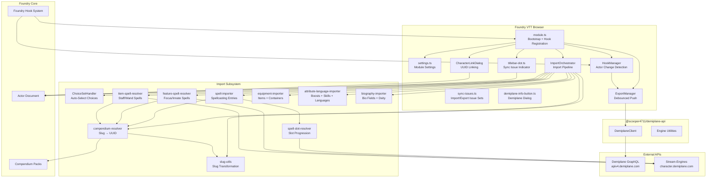
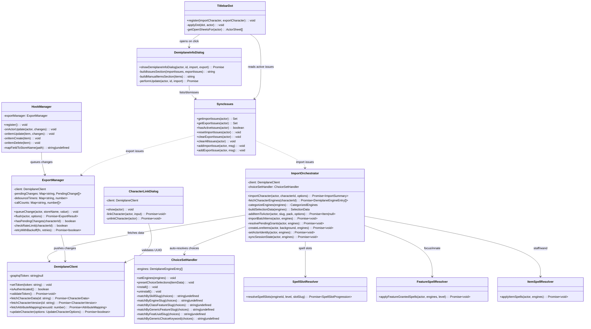
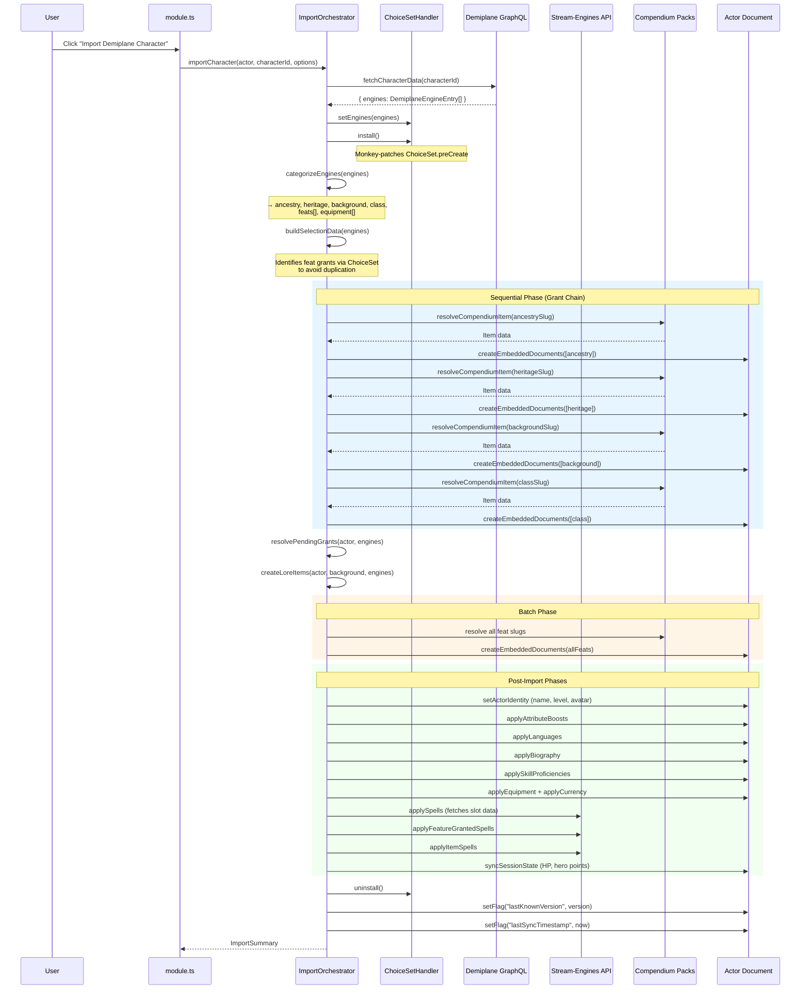
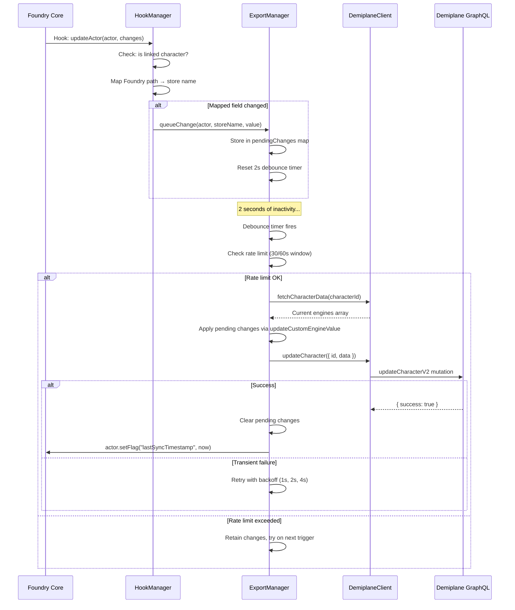
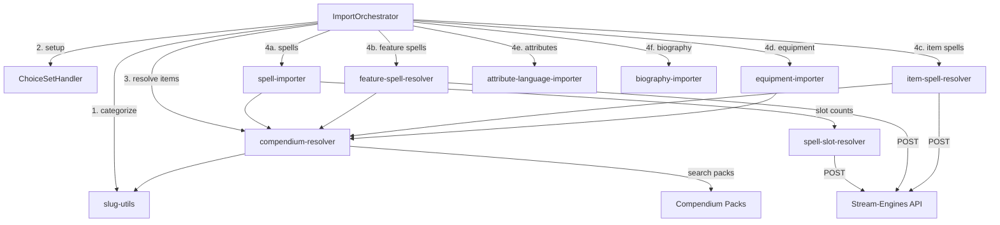
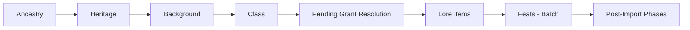

# Architecture

This document describes the internal architecture of `demiplane-pf2e`: component responsibilities, class relationships, data flow through the system, and lifecycle hooks.

---

## Table of Contents

- [Component Overview](#component-overview)
- [Class Diagram](#class-diagram)
- [Module Initialization](#module-initialization)
- [Import Data Flow](#import-data-flow)
- [Export Data Flow](#export-data-flow)
- [Conflict Detection Flow](#conflict-detection-flow)
- [File Structure](#file-structure)
- [Import Subsystem Detail](#import-subsystem-detail)
- [Hook Lifecycle](#hook-lifecycle)
- [Compendium Resolution](#compendium-resolution)
- [ChoiceSet Auto-Resolution](#choiceset-auto-resolution)
- [Grant Chain Sequencing](#grant-chain-sequencing)

---

## Component Overview



---

## Class Diagram



---

## Module Initialization

```mermaid
sequenceDiagram
    participant Foundry
    participant Module as module.ts
    participant Settings as settings.ts

    Foundry->>Module: Hooks.once("init")
    Module->>Settings: registerSettings()
    Note over Settings: Registers: autoSync, demiplaneToken, debugImport

    Foundry->>Module: Hooks.once("ready")
    Module->>Module: Create DemiplaneClient
    Module->>Module: Read token from settings
    Module->>Module: client.setToken(token) if configured

    Module->>Module: Create ImportOrchestrator(client)
    Module->>Module: Create ExportManager(client)
    Module->>Module: Create HookManager(exportManager)
    Module->>Module: Create CharacterLinkDialog(client)

    Module->>Module: hookManager.register()
    Note over Module: Registers updateActor, updateItem,<br/>createItem, deleteItem hooks

    Module->>Module: registerDemiplaneInfoButton(import, export)
    Module->>Module: registerTitlebarDot(import, export)
    Note over Module: Renders sync-issue dot on linked sheet titlebars;<br/>click opens the Demiplane dialog

    Module->>Module: Expose module API on game.modules

    Foundry->>Module: Hooks.on("renderActorDirectory")
    Module->>Module: Add "Import Demiplane Character" button

    Foundry->>Module: Hooks.on("getActorContextOptions")
    Module->>Module: Add "Update from Demiplane" context menu
```

**Module API** (exposed on `game.modules.get("demiplane-pf2e").api`):

| Method                            | Description                 |
| --------------------------------- | --------------------------- |
| `importCharacter(actor, options)` | Trigger a full import       |
| `exportNow(actor)`                | Force-flush pending changes |

---

## Import Data Flow



---

## Export Data Flow



---

## File Structure

```
src/
├── module.ts                      Entry point: hook registration, service wiring, API exposure
├── settings.ts                    Foundry module settings (token, autoSync, debugImport)
├── hook-manager.ts                Listens to actor/item hooks, maps fields, queues exports
├── export-manager.ts              Debounced + rate-limited push to Demiplane
├── sync-issues.ts                Import/export sync-issue sets on linked actors
├── titlebar-dot.ts               Red indicator on actor sheet titlebars for open issues
├── demiplane-info-button.ts      Header button + Demiplane dialog (lists issues, dismissable)
├── character-link-dialog.ts       Dialog for linking/unlinking UUID to actor
├── character-link-input.ts        Parses UUID or Demiplane URL
├── slug-mapper.ts                 (Legacy) standalone slug resolution class
├── attribute-skill-importer.ts    (Legacy) standalone attribute/skill functions
│
├── import/
│   ├── index.ts                   Barrel re-export
│   ├── types.ts                   Core types: DemiplaneEngineEntry, ImportSummary, etc.
│   ├── orchestrator.ts            Central import pipeline coordinator
│   ├── slug-utils.ts              Slug transformation and categorization
│   ├── compendium-resolver.ts     Slug → compendium UUID resolution
│   ├── choice-set-handler.ts      ChoiceSet monkey-patch with 6 strategies
│   ├── debug-log.ts               Conditional debug logging
│   │
│   ├── spell-importer.ts          Class spellcasting entries + spell placement
│   ├── spell-engines.ts           Spell engine identification helpers
│   ├── spell-slot-resolver.ts     Fetches slot progression from stream-engines
│   ├── feature-spell-resolver.ts  Focus/innate spells from class features
│   ├── item-spell-resolver.ts     Staff/wand spells from items
│   │
│   ├── equipment-importer.ts      Equipment + containers + carry state
│   ├── attribute-language-importer.ts  Boosts, skills, languages
│   └── biography-importer.ts      Biography fields, deity, organized play
│
└── pf2e-foundry-config.d.ts       Type augmentations for Foundry/PF2e
```

---

## Import Subsystem Detail

The import subsystem is the most complex part of the module. Here is how its components interact:



### Import Phase Order

| Phase | Component                     | What It Does                                         |
| ----- | ----------------------------- | ---------------------------------------------------- |
| 1     | `orchestrator`                | Fetch engines, categorize by type                    |
| 2     | `ChoiceSetHandler`            | Install monkey-patch for auto-selection              |
| 3     | `orchestrator`                | Sequential: ancestry → heritage → background → class |
| 4     | `orchestrator`                | Resolve pending grants from sequential items         |
| 5     | `orchestrator`                | Create lore items from background                    |
| 6     | `orchestrator`                | Batch: all feats                                     |
| 7     | `equipment-importer`          | Equipment with containers and carry state            |
| 8     | `attribute-language-importer` | Attribute boosts, skill proficiencies, languages     |
| 9     | `biography-importer`          | Biography text fields, deity                         |
| 10    | `spell-importer`              | Class spellcasting entries with slot placement       |
| 11    | `feature-spell-resolver`      | Focus and innate spells from features                |
| 12    | `item-spell-resolver`         | Staff and wand spell lists                           |
| 13    | `orchestrator`                | Session state (HP, hero points, etc.)                |
| 14    | `ChoiceSetHandler`            | Uninstall monkey-patch                               |
| 15    | `orchestrator`                | Stamp version + timestamp flags                      |

---

## Hook Lifecycle

`HookManager` registers four Foundry hooks during initialization:

| Hook          | Trigger                        | Action                                                |
| ------------- | ------------------------------ | ----------------------------------------------------- |
| `updateActor` | Actor data changes             | Maps field path → Demiplane store name, queues export |
| `updateItem`  | Item on linked actor changes   | Logs change (future: consumable sync)                 |
| `createItem`  | Item added to linked actor     | Logs creation (future: equipment sync)                |
| `deleteItem`  | Item removed from linked actor | Logs deletion (future: equipment sync)                |

All hooks filter for: `actor.type === "character"` AND actor has `demiplane-pf2e.characterId` flag set.

### Actor Field → Store Name Mapping

| Foundry Actor Path                  | Demiplane Store Name           |
| ----------------------------------- | ------------------------------ |
| `system.attributes.hp.value`        | `character_hit-points_current` |
| `system.attributes.hp.temp`         | `character_hit-points_temp`    |
| `system.resources.heroPoints.value` | `character_hero-points`        |
| `system.resources.focus.value`      | `character_focus_current`      |
| `system.currency.gp`                | `character_currency_gold`      |
| `system.currency.sp`                | `character_currency_silver`    |
| `system.currency.cp`                | `character_currency_copper`    |
| `system.currency.pp`                | `character_currency_platinum`  |

---

## Compendium Resolution

The `compendium-resolver` module searches PF2e compendium packs by `system.slug` to find the Foundry item UUID for a given Demiplane slug.

### Resolution Algorithm

```
Input: Demiplane slug (e.g., "weapon-specialization-fighter-rm")

1. Transform: toFoundrySlug() strips "-rm" suffix → "weapon-specialization-fighter"
2. Generate candidates:
   a. Exact: "weapon-specialization-fighter"
   b. Strip class suffix: "weapon-specialization"
   c. Bloodline prefix: "bloodline-weapon-specialization-fighter" (if applicable)
3. For each candidate, search target pack(s) by system.slug
4. Return first match, or undefined if none found
```

### Pack Search Order

| Pack                 | Contents                  |
| -------------------- | ------------------------- |
| `pf2e.ancestries`    | Ancestries                |
| `pf2e.heritages`     | Heritages                 |
| `pf2e.backgrounds`   | Backgrounds               |
| `pf2e.classes`       | Classes                   |
| `pf2e.classfeatures` | Class features            |
| `pf2e.feats-srd`     | Feats                     |
| `pf2e.spells-srd`    | Spells                    |
| `pf2e.equipment-srd` | Equipment, armor, weapons |

The resolver accepts a target pack parameter to search a specific pack, or searches all packs in order.

---

## ChoiceSet Auto-Resolution

When items are added to a PF2e actor, the system's `ChoiceSetRuleElement` normally presents an interactive dialog for player choices (e.g., "choose a skill to increase"). During automated import, these must be resolved without user interaction.

The `ChoiceSetHandler` monkey-patches `ChoiceSet.preCreate` to intercept choice prompts and auto-select the correct option using 6 strategies (tried in priority order):

| Priority | Strategy                | Matches Against                                                    |
| -------- | ----------------------- | ------------------------------------------------------------------ |
| 1        | Skill slugs             | `core/selection/skill/increase` engine slugs                       |
| 2        | All engine slugs        | Any DemiplaneEngine `args.slug`                                    |
| 3        | Class feature slugs     | Choice labels slugified against class feature engines              |
| 4        | Generic feature slugs   | Partial match of `generic-feature` engine slugs                    |
| 5        | Feat UUID slugs         | Choice labels against feat engines with `select-feat-` sourceRow   |
| 6        | Generic choice keywords | Last segment of `generic-choice` engine slug against choice values |

**Fallback:** If no strategy matches, selects `choices[0]`.

The monkey-patch is installed before import begins and uninstalled after import completes, so normal interactive behavior is restored for manual character editing.

---

## Grant Chain Sequencing

The PF2e system uses a **Grant Chain** — when items are added, `GrantItem` rule elements automatically create sub-items. This requires careful ordering during import.

### Why Sequential

```
Class (wizard)
  └── GrantItem → "Arcane Spellcasting" (class feature)
  └── GrantItem → "Arcane School" (class feature)
       └── ChoiceSet → pick a school
            └── GrantItem → school-specific feature
```

If class features aren't present when ancestry is evaluated, or if the class isn't present when feats are added, the Grant Chain cannot resolve prerequisite checks.

### Ordering Constraint



**Sequential (one at a time, await each):** Ancestry → Heritage → Background → Class

**Batch (single `createEmbeddedDocuments` call):** All feats together

**Independent (any order):** Equipment, spells, attributes, biography — these don't trigger Grant Chains that depend on ordering.

### Engine Categorization Rules

The orchestrator categorizes engines by inspecting the `name` path:

| Path Contains                         | Category   | Notes                          |
| ------------------------------------- | ---------- | ------------------------------ |
| `/classfeature/` or `/class-feature/` | (skipped)  | Granted automatically by class |
| `/ancestry/`                          | ancestry   |                                |
| `/heritage/`                          | heritage   |                                |
| `/background/`                        | background |                                |
| `/class/`                             | class      | Checked after classfeature     |
| `/feat/`                              | feat       |                                |
| `/spell/`                             | spell      | Handled by spell-importer      |
| `/item/`                              | equipment  |                                |

Class features are explicitly excluded from direct import because the PF2e Grant Chain creates them automatically when the class item is added.
