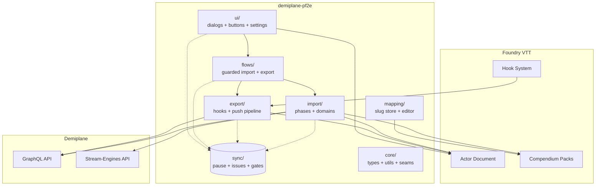
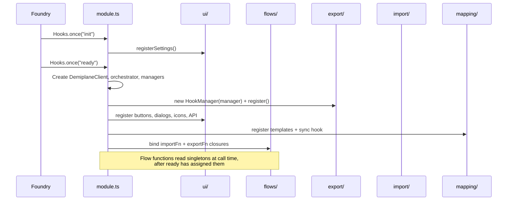
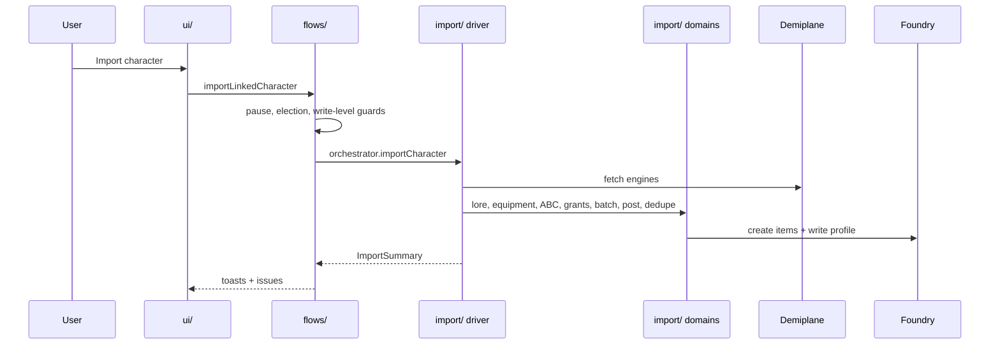
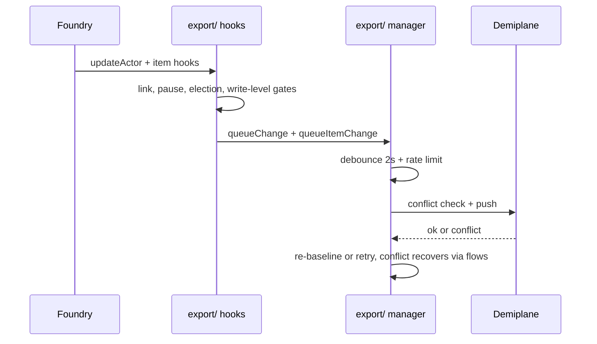
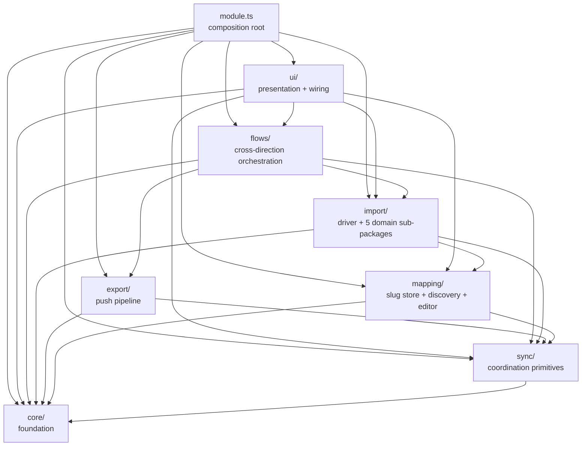

# Architecture

This document describes the internal architecture of `demiplane-pf2e`: component responsibilities, class relationships, data flow through the system, and lifecycle hooks.

---

## Table of Contents

- [Component Overview](#component-overview)
- [Module Initialization](#module-initialization)
- [Import Data Flow](#import-data-flow)
- [Export Data Flow](#export-data-flow)
- [Package Layout](#package-layout)
- [Import Subsystem Detail](#import-subsystem-detail)
- [Hook Lifecycle](#hook-lifecycle)
- [Compendium Resolution](#compendium-resolution)
- [ChoiceSet Auto-Resolution](#choiceset-auto-resolution)
- [Grant Chain Sequencing](#grant-chain-sequencing)

---

## Component Overview

## Component Overview

Runtime data flow at package level — solid edges are calls, dotted edges
are reads and writes against `sync/` actor-flag state. Class-level detail
lives in each package's `DESIGN.md` (linked from
[Package Layout](#package-layout)).


```mermaid
graph TD
    subgraph "Foundry VTT"
        HOOKS[Hook System]
        ACTOR[Actor Document]
        COMP[Compendium Packs]
    end
    subgraph "demiplane-pf2e"
        UI["ui/<br/>dialogs + buttons + settings"]
        FLOWS["flows/<br/>guarded import + export"]
        IMPORT["import/<br/>phases + domains"]
        EXPORT["export/<br/>hooks + push pipeline"]
        MAPPING["mapping/<br/>slug store + editor"]
        SYNC[("sync/<br/>pause + issues + gates")]
        CORE["core/<br/>types + utils + seams"]
    end
    subgraph "Demiplane"
        GQL[GraphQL API]
        SE[Stream-Engines API]
    end

    HOOKS --> EXPORT
    UI --> FLOWS
    FLOWS --> IMPORT
    FLOWS --> EXPORT
    IMPORT --> ACTOR
    IMPORT --> COMP
    IMPORT --> GQL
    IMPORT --> SE
    EXPORT --> GQL
    EXPORT --> ACTOR
    MAPPING --> COMP
    UI --> ACTOR
    IMPORT -.-> SYNC
    EXPORT -.-> SYNC
    FLOWS -.-> SYNC
    UI -.-> SYNC
```

---

## Classes by Package

Class-level interaction diagrams live with the code they describe — one
focused diagram per package, showing its classes plus their edges outside
the package:

- Push pipeline: [`src/export/DESIGN.md`](../src/export/DESIGN.md)
- Import driver and domains: [`src/import/DESIGN.md`](../src/import/DESIGN.md),
  [`choices/`](../src/import/choices/DESIGN.md),
  [`spells/`](../src/import/spells/DESIGN.md)
- Sync store and gates: [`src/sync/DESIGN.md`](../src/sync/DESIGN.md)
- Flows bridge: [`src/flows/DESIGN.md`](../src/flows/DESIGN.md)
- Mapping editor and store: [`src/mapping/DESIGN.md`](../src/mapping/DESIGN.md)
- Dialogs and wiring: [`src/ui/DESIGN.md`](../src/ui/DESIGN.md)

---

## Module Initialization

## Module Lifecycle


```mermaid
sequenceDiagram
    participant Foundry
    participant Module as module.ts
    participant UI as ui/
    participant Flows as flows/
    participant Export as export/
    participant Import as import/
    participant Mapping as mapping/

    Foundry->>Module: Hooks.once("init")
    Module->>UI: registerSettings()
    Foundry->>Module: Hooks.once("ready")
    Module->>Module: Create DemiplaneClient, orchestrator, managers
    Module->>Export: new HookManager(manager) + register()
    Module->>UI: register buttons, dialogs, icons, API
    Module->>Mapping: register templates + sync hook
    Module->>Flows: bind importFn + exportFn closures
    Note over Module,Flows: Flow functions read singletons at call time,<br/>after ready has assigned them
```

**Module API** (exposed on `game.modules.get("demiplane-pf2e").api`):

| Method                            | Description                 |
| --------------------------------- | --------------------------- |
| `importCharacter(actor, options)` | Trigger a full import       |
| `exportNow(actor)`                | Force-flush pending changes |

---

## Import Data Flow

## Import Data Flow


```mermaid
sequenceDiagram
    participant User
    participant UI as ui/
    participant Flows as flows/
    participant Driver as import/ driver
    participant Domains as import/ domains
    participant Demiplane
    participant Foundry

    User->>UI: Import character
    UI->>Flows: importLinkedCharacter
    Flows->>Flows: pause, election, write-level guards
    Flows->>Driver: orchestrator.importCharacter
    Driver->>Demiplane: fetch engines
    Driver->>Domains: lore, equipment, ABC, grants, batch, post, dedupe
    Domains->>Foundry: create items + write profile
    Driver-->>Flows: ImportSummary
    Flows-->>UI: toasts + issues
```

The phase-by-phase sequence lives in
[`src/import/DESIGN.md`](../src/import/DESIGN.md#import-data-flow-detail).

---

## Export Data Flow

## Export Data Flow


```mermaid
sequenceDiagram
    participant Foundry
    participant Hooks as export/ hooks
    participant Manager as export/ manager
    participant Demiplane

    Foundry->>Hooks: updateActor + item hooks
    Hooks->>Hooks: link, pause, election, write-level gates
    Hooks->>Manager: queueChange + queueItemChange
    Manager->>Manager: debounce 2s + rate limit
    Manager->>Demiplane: conflict check + push
    Demiplane-->>Manager: ok or conflict
    Manager->>Manager: re-baseline or retry, conflict recovers via flows
```

The hook-by-hook sequence lives in
[`src/export/DESIGN.md`](../src/export/DESIGN.md#export-data-flow-detail).

---

## Package Layout

`src/` is split into cohesive packages with a strict dependency direction
(`core` ← `sync`/`export`/`mapping` ← `import` ← `ui`, plus `flows` as the
single bridge above `sync`/`import`/`export`, and `module.ts` wiring it
all). Each package exposes a curated `index.ts` barrel — the complete
public surface — and every cross-package import targets a barrel, never a
deep file. Both invariants are enforced by dependency-cruiser
(`npm run check:deps`, wired into the pre-commit hook and CI). Each
package documents its responsibility, surface, and mechanics in a
co-located `DESIGN.md`:

- [`src/core/DESIGN.md`](../src/core/DESIGN.md) — foundation
- [`src/sync/DESIGN.md`](../src/sync/DESIGN.md) — coordination primitives
- [`src/flows/DESIGN.md`](../src/flows/DESIGN.md) — cross-direction orchestration
- [`src/export/DESIGN.md`](../src/export/DESIGN.md) — push pipeline
- [`src/mapping/DESIGN.md`](../src/mapping/DESIGN.md) — slug store + discovery + editor
- [`src/ui/DESIGN.md`](../src/ui/DESIGN.md) — presentation shell
- [`src/import/DESIGN.md`](../src/import/DESIGN.md) — import driver
- [`src/import/shared/DESIGN.md`](../src/import/shared/DESIGN.md),
  [`character/`](../src/import/character/DESIGN.md),
  [`choices/`](../src/import/choices/DESIGN.md),
  [`equipment/`](../src/import/equipment/DESIGN.md),
  [`spells/`](../src/import/spells/DESIGN.md) — import domains


```mermaid
graph TD
    MOD["module.ts<br/>composition root"]
    UI["ui/<br/>presentation + wiring"]
    FLOWS["flows/<br/>cross-direction orchestration"]
    IMPORT["import/<br/>driver + 5 domain sub-packages"]
    EXPORT["export/<br/>push pipeline"]
    MAPPING["mapping/<br/>slug store + discovery + editor"]
    SYNC["sync/<br/>coordination primitives"]
    CORE["core/<br/>foundation"]

    MOD --> UI
    MOD --> FLOWS
    MOD --> IMPORT
    MOD --> EXPORT
    MOD --> MAPPING
    MOD --> SYNC
    MOD --> CORE
    UI --> FLOWS
    UI --> IMPORT
    UI --> MAPPING
    UI --> SYNC
    UI --> CORE
    FLOWS --> IMPORT
    FLOWS --> EXPORT
    FLOWS --> SYNC
    FLOWS --> CORE
    IMPORT --> MAPPING
    IMPORT --> SYNC
    IMPORT --> CORE
    EXPORT --> SYNC
    EXPORT --> CORE
    MAPPING --> SYNC
    MAPPING --> CORE
    SYNC --> CORE
```

```
src/
├── module.ts        Composition root: singletons, hook registration, binds flows (imports barrels only)
├── foundry.d.ts / foundry-globals.d.ts  Ambient Foundry type shims (no runtime imports)
├── core/            Foundation — types, config, slug-utils, engine-sig, pf2e-types, libwrapper, token(-source), debug-log
├── sync/            Coordination — actor-link, sync-pause/election/notice/issues, write-level
├── flows/           Bridge — sync-flows (guarded import, manual export, conflict recovery)
├── export/          Push pipeline — export-manager, hook-manager + change-buffer, push-payload-builder, conflict-resolver, spellcasting-entry-sync
├── mapping/         Slug store + share, pack-discovery, pack-index, mapping editor app
├── ui/              Shell — settings, module-api, info-button/dialog, link dialog+input, directory icon/import, context menu, titlebar dot
└── import/
    ├── orchestrator.ts / phases.ts / reconcile.ts / variant-check.ts  Driver + phase pipeline
    ├── shared/      compendium-resolver, stream-engines, pf2e-ranks
    ├── character/   biography, attribute-language, remaster-renames
    ├── choices/     choice-set-handler + registry, matchers, class configs, overrides, ikon resolver
    ├── equipment/   equipment-importer/sources, weapon-runes, container-placement, crafting-formulas
    └── spells/      spell-importer/grouping/engines, slots + resolver, casting-entry/features, prepared-spells, divine-font, feature-spell-resolver
```

---

## Import Subsystem Detail

The import subsystem is the most complex part of the module. Here is how its components interact:

The driver-to-domain interaction graph lives in
[`src/import/DESIGN.md`](../src/import/DESIGN.md#driver-to-domain-interactions).

### Import Phase Order

### Import Phase Order

| Phase | Component               | What It Does                                                                                                   |
| ----- | ----------------------- | -------------------------------------------------------------------------------------------------------------- |
| 1     | `ImportOrchestrator`    | Fetch engines, stamp `lastUpdated`/`engineSig` flags                                                           |
| 2     | `ChoiceSetHandler`      | Install monkey-patch for auto-selection                                                                        |
| 3     | `LoreItemsPhase`        | Create lore items (must precede ancestry/class)                                                                |
| 4     | `EquipmentPhase`        | Create equipment early so owned items exist before the class grant chain; resized after ancestry size is known |
| 5     | `SequentialItemsPhase`  | Sequential: ancestry → heritage → background → class                                                           |
| 6     | `ResolveGrantsPhase`    | Resolve pending native grants; exclude from batch                                                              |
| 7     | `BatchItemsPhase`       | Batch: all feats                                                                                               |
| 8     | `PostProcessingPhase`   | Identity, boosts, skills, languages, bio, formulas, currency, spells, feature spells, session state            |
| 9     | `RemoveDuplicatesPhase` | Remove import-stamped duplicates of native grants                                                              |
| 10    | `ChoiceSetHandler`      | Uninstall monkey-patch                                                                                         |
| 11    | `ImportOrchestrator`    | Stamp `lastImportTimestamp` flag                                                                               |
| 12    | `ImportOrchestrator`    | Import "Campaign" journal → `biography.campaignNotes` (needs no monkey-patch; runs after uninstall)            |

The `ImportPhase` pipeline steps (3–9) are implemented in `src/import/phases.ts`
and driven in order by `ImportOrchestrator.importCharacter` inside its
`try/finally`. Each phase receives an `ImportContext` carrying the fetched
`engines`, the `ImportSummary`, the `ChoiceSetHandler`, the categorized engines,
the selection data, and the resolved-grant slugs.

---

## Hook Lifecycle

`HookManager` registers four Foundry hooks during initialization:

| Hook          | Trigger                        | Action                                                                        |
| ------------- | ------------------------------ | ----------------------------------------------------------------------------- |
| `updateActor` | Actor data changes             | Maps field path → Demiplane store name, queues export (skipped while syncing) |
| `updateItem`  | Item on linked actor changes   | Queues item change (skipped while syncing)                                    |
| `createItem`  | Item added to linked actor     | Logs creation (skipped while syncing)                                         |
| `deleteItem`  | Item removed from linked actor | Queues deletion (skipped while syncing)                                       |

All hooks filter for: `actor.type === "character"` AND actor has `demiplane-pf2e.characterId` flag set. **While any client has an in-flight import or push for the character** (the `demiplane-pf2e.syncActiveTokens` actor flag is non-empty), the hooks suppress queueing so a sync's replicated actor updates don't echo back to Demiplane. See `sync/sync-pause.ts` and DESIGN §16.

### Actor Field → Store Name Mapping

| Foundry Actor Path                  | Demiplane Store Name           |
| ----------------------------------- | ------------------------------ |
| `system.attributes.hp.value`        | `character_hit-points_current` |
| `system.attributes.hp.temp`         | `character_hit-points_temp`    |
| `system.resources.heroPoints.value` | `character_hero-points`        |
| `system.resources.focus.value`      | `character_focus_current`      |
| `system.currency.gp`                | `character_currency_gold`      |
| `system.currency.sp`                | `character_currency_silver`    |
| `system.currency.cp`                | `character_currency_copper`    |
| `system.currency.pp`                | `character_currency_platinum`  |

### Fields that do not round-trip

Proven live by the Kyra mutation round-trip spec. These actor fields cannot
survive a push → wipe → re-import cycle, so the suite (and GMs) should not
expect them to:

| Field                               | Why not                                                                                                                                                                                        |
| ----------------------------------- | ---------------------------------------------------------------------------------------------------------------------------------------------------------------------------------------------- |
| Deity (`details.deity`, deity item) | Build-derived (a cleric's deity comes from the class choice); the module never pushes it, and an import always resolves it from the deity engine. See DESIGN §25.                              |
| `details.languages.value` additions | PF2e recomputes the list from grants on every prepare, silently discarding directly-written languages that have no granting source. (The import side shares this gap for ungranted languages.) |
| `system.pfs.characterNumber`        | PF2e silently ignores direct writes (the sibling `playerNumber` persists). The combined `character_organizedplayid` engine still round-trips whatever is stored.                               |
| Item `carryType` (stowed/carried)   | The push records only hand-slot assignment and the equipped flag; the import defaults anything else to worn. Only held ⇄ worn round-trips.                                                     |

Display metadata (`formated_data`, the `{format: {name, class, level, avatar}}`
blob the overview page renders as "Lvl X Class") is builder-owned: pushes pass
it through untouched and never construct it. See DESIGN §29.

---

## Compendium Resolution

The `compendium-resolver` module resolves a Demiplane slug to a Foundry item, checking the GM/recorded mapping first and otherwise searching PF2e compendium packs by `system.slug`.

### Resolution Algorithm

```
Input: Demiplane slug (e.g., "weapon-specialization-fighter-rm")

0. Mapping first: resolveMappedItem() returns the recorded/GM mapping if present
   (a mapping whose target is gone returns null, so resolution falls through).
1. Transform: toFoundrySlug() strips "-rm" suffix → "weapon-specialization-fighter"
2. Generate candidates:
   a. Exact: "weapon-specialization-fighter"
   b. Strip class suffix: "weapon-specialization"
   c. Bloodline prefix: "bloodline-weapon-specialization-fighter" (if applicable)
3. For each candidate, search target pack(s) by system.slug
4. On match: record it via recordResolvedMapping() so the next lookup hits the
   mapping first and the editor can show it, then return the item.
5. Return null if no candidate matches (slug recorded as unmapped).
```

Recording is non-clobbering — an existing GM override or prior recording is left
as-is — so it never changes what resolves, only caches the outcome. See
[DESIGN §22](./DESIGN.md#22-recorded-resolutions-and-the-full-mapping-list).

### Pack Search Order

| Pack                 | Contents                  |
| -------------------- | ------------------------- |
| `pf2e.ancestries`    | Ancestries                |
| `pf2e.heritages`     | Heritages                 |
| `pf2e.backgrounds`   | Backgrounds               |
| `pf2e.classes`       | Classes                   |
| `pf2e.classfeatures` | Class features            |
| `pf2e.feats-srd`     | Feats                     |
| `pf2e.spells-srd`    | Spells                    |
| `pf2e.equipment-srd` | Equipment, armor, weapons |

The resolver accepts a target pack parameter to search a specific pack, or searches all packs in order.

---

## ChoiceSet Auto-Resolution

When items are added to a PF2e actor, the system's `ChoiceSetRuleElement` normally presents an interactive dialog for player choices (e.g., "choose a skill to increase"). During automated import, these must be resolved without user interaction.

The `ChoiceSetHandler` wraps `ChoiceSet.preCreate` to intercept choice prompts and auto-select the correct option. When the community **libWrapper** module is active the wrap is registered through it (`src/core/libwrapper.ts`); otherwise the handler falls back to a direct prototype patch whose `disable()` restores the original only if our patch is still the live method (so a wrapper another module installed later is never clobbered). See [DESIGN §7](./DESIGN.md#7-choiceset-wrapping-libwrapper-when-available). The strategies live in `import/choices/choice-matchers.ts` as pure functions and are composed by `findMatchInChoices` in priority order (7 strategies):

| Priority | Strategy                | Matches Against                                                          |
| -------- | ----------------------- | ------------------------------------------------------------------------ |
| 1        | Skill slugs             | `core/selection/skill/increase` engine slugs                             |
| 2        | Custom-selection lore   | `core/selection/skill/custom-selection` engine name (e.g. "Forest Lore") |
| 3        | All engine slugs        | Any DemiplaneEngine `args.slug`                                          |
| 4        | Class feature slugs     | Choice labels slugified against class feature engines                    |
| 5        | Generic feature slugs   | Partial match of `generic-feature` engine slugs                          |
| 6        | Feat UUID slugs         | Choice labels against feat engines with `select-feat-` sourceRow         |
| 7        | Generic choice keywords | Last segment of `generic-choice` engine slug against choice values       |

**Fallback:** If no strategy matches, selects `choices[0]`.

The `ChoiceSetHandler` owns the monkey-patch lifecycle (`enable`/`disable`), the `preCreate` interception, and pre-setting selections on item data (`presetChoiceSelections`). The strategy matching itself is delegated to `choice-matchers.ts`, keeping the handler focused on patching and the matchers independently testable.

The wrap is installed before import begins and removed after import completes, so normal interactive behavior is restored for manual character editing.

---

## Grant Chain Sequencing

The PF2e system uses a **Grant Chain** — when items are added, `GrantItem` rule elements automatically create sub-items. This requires careful ordering during import.

### Why Sequential

```
Class (wizard)
  └── GrantItem → "Arcane Spellcasting" (class feature)
  └── GrantItem → "Arcane School" (class feature)
       └── ChoiceSet → pick a school
            └── GrantItem → school-specific feature
```

If class features aren't present when ancestry is evaluated, or if the class isn't present when feats are added, the Grant Chain cannot resolve prerequisite checks.

### Ordering Constraint

The grant-chain ordering diagram lives in
[`src/import/DESIGN.md`](../src/import/DESIGN.md#grant-chain-ordering).

**Sequential (one at a time, await each):** Ancestry → Heritage → Background → Class

**Batch (single `createEmbeddedDocuments` call):** All feats together

**Independent (any order):** Equipment, spells, attributes, biography — these don't trigger Grant Chains that depend on ordering.

### Engine Categorization Rules

The import pipeline (`categorizeEngines` in `src/import/phases.ts`, called by
`ImportOrchestrator.importCharacter`) categorizes engines by inspecting the `name` path:

| Path Contains                         | Category   | Notes                          |
| ------------------------------------- | ---------- | ------------------------------ |
| `/classfeature/` or `/class-feature/` | (skipped)  | Granted automatically by class |
| `/ancestry/`                          | ancestry   |                                |
| `/heritage/`                          | heritage   |                                |
| `/background/`                        | background |                                |
| `/class/`                             | class      | Checked after classfeature     |
| `/feat/`                              | feat       |                                |
| `/spell/`                             | spell      | Handled by spell-importer      |
| `/item/`                              | equipment  |                                |

Class features are explicitly excluded from direct import because the PF2e Grant Chain creates them automatically when the class item is added.
