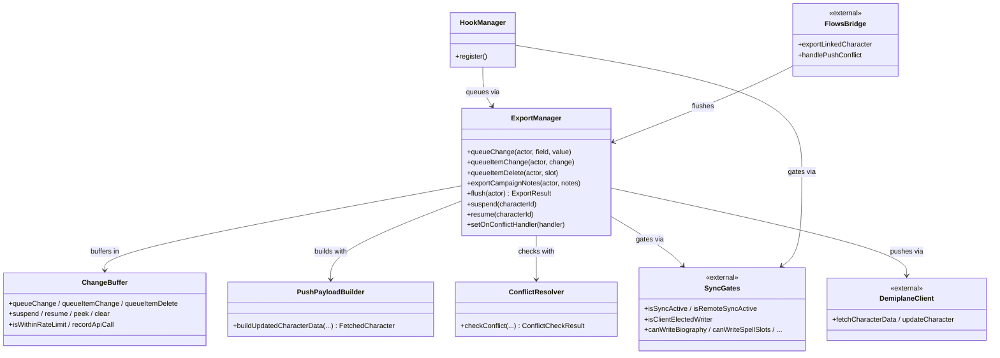
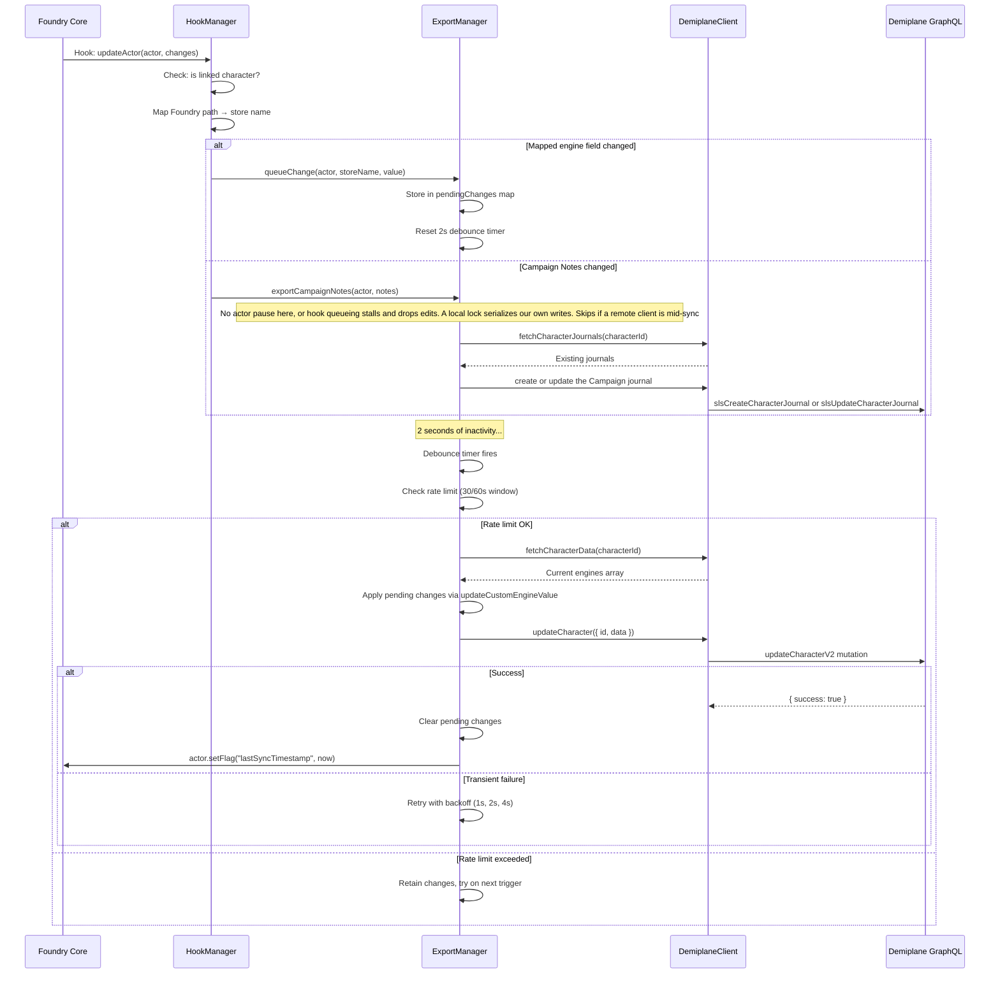

# `export` package

Foundry → Demiplane push pipeline. Depends on `core` and `sync` only
(enforced by `export-depends-inward`). `HookManager` (Foundry document
hooks) feeds `ExportManager` (debounced, retried push); the buffer,
payload builder, and conflict check are internal collaborators owned by
the manager.

## Responsibility

Turn local actor/item edits on linked characters into rate-limited,
conflict-checked Demiplane pushes — and nothing else. Import never flows
through here; the `flows/` bridge calls in from above. See
[DESIGN §3–§5](../../../docs/DESIGN.md#3-two-second-debounce-window-for-export),
[§14](../../../docs/DESIGN.md#14-exponential-backoff-retry-strategy),
[§17](../../../docs/DESIGN.md#17-conflict-resolution-heuristic),
[§27–§28](../../../docs/DESIGN.md#27-journal-writes-without-the-actor-pause).

## Public surface

`index.ts` is authoritative (6 names). Only the manager, the hook
registration, and the queue entry points used by `flows/` are public;
`ChangeBuffer`, `PushPayloadBuilder`, `ConflictResolver`, and the
spellcasting-entry queue helpers are internal details reached through
`ExportManager` / `HookManager`.

| From                | Role                                                | Names                                                                                       |
| ------------------- | --------------------------------------------------- | ------------------------------------------------------------------------------------------- |
| `export-manager.ts` | Debounced, rate-limited, retried push orchestration | `ExportManager`, `ExportResult`                                                             |
| `hook-manager.ts`   | Foundry hook → buffered-change translation          | `HookManager`, `queueCombatResourceChanges`, `queueAllItemChanges`, `queueAllDetailChanges` |

Internal (not exported): `change-buffer.ts` (2s debounce, 30/min rate
limit, per-character pending maps, suspend counts), `push-payload-builder.ts`
(buffered changes → Demiplane payload with slug→engine resolution),
`conflict-resolver.ts` (`updated` + `engine-sig` optimistic-concurrency
check), `spellcasting-entry-sync.ts` (prepared-expended and spontaneous
slot bookkeeping).

## How it works

- Ingress: `HookManager.register` subscribes to `updateActor`,
  `createItem`, `updateItem`, `deleteItem`. Each hook checks the link flag,
  sync-pause state, writer election, and the per-capability write gate
  before queueing — unlinked actors and mid-sync echoes never reach the
  buffer.
- Pipeline: `ExportManager.flush` enforces election, checks
  `isRemoteSyncActive`, runs the conflict check, builds the payload, and
  pushes with exponential-backoff retry. Journal (campaign-notes) writes
  bypass the actor pause under a local promise lock (§27).
- Every capability question (`canWriteHitPoints`, …) delegates to
  `sync/write-level.ts`; this package never reads the write-level setting
  directly.

## Constraints

- Depends only on `core` and `sync` (via their barrels). No imports from
  `import/`, `mapping/`, or `ui/`.
- `hook-manager.ts` lives here — not in `sync/` — because ingress and
  pipeline are one cohesive unit: the hooks exist only to feed this buffer.

## Interactions

Pipeline classes plus their edges outside the package — hooks and the
manager gate through `sync/`, the bridge flushes through the manager:

### Export data flow detail

Hook-by-hook sequence behind the package-level flow in
[ARCHITECTURE](../../../docs/ARCHITECTURE.md#export-data-flow):

