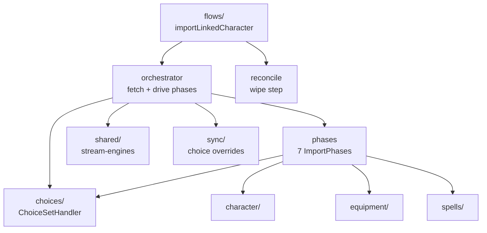
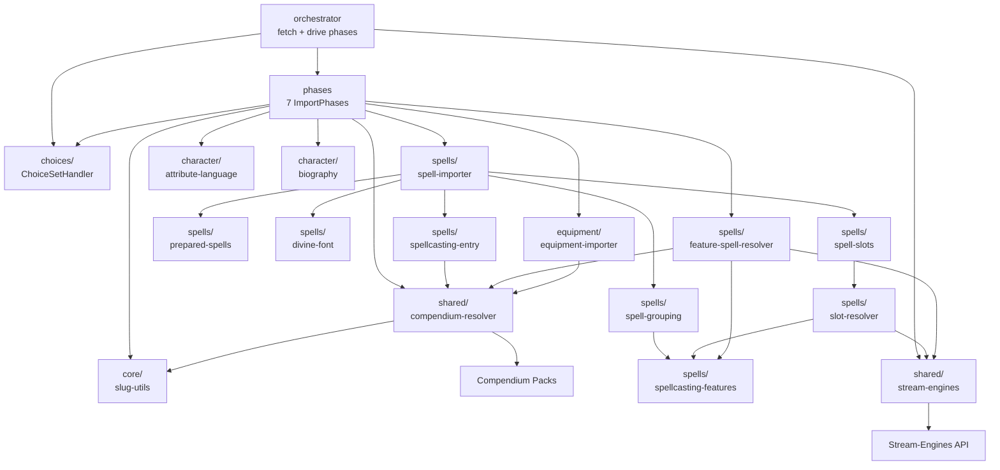
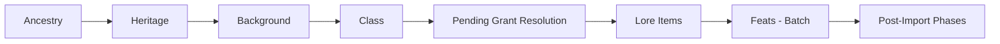
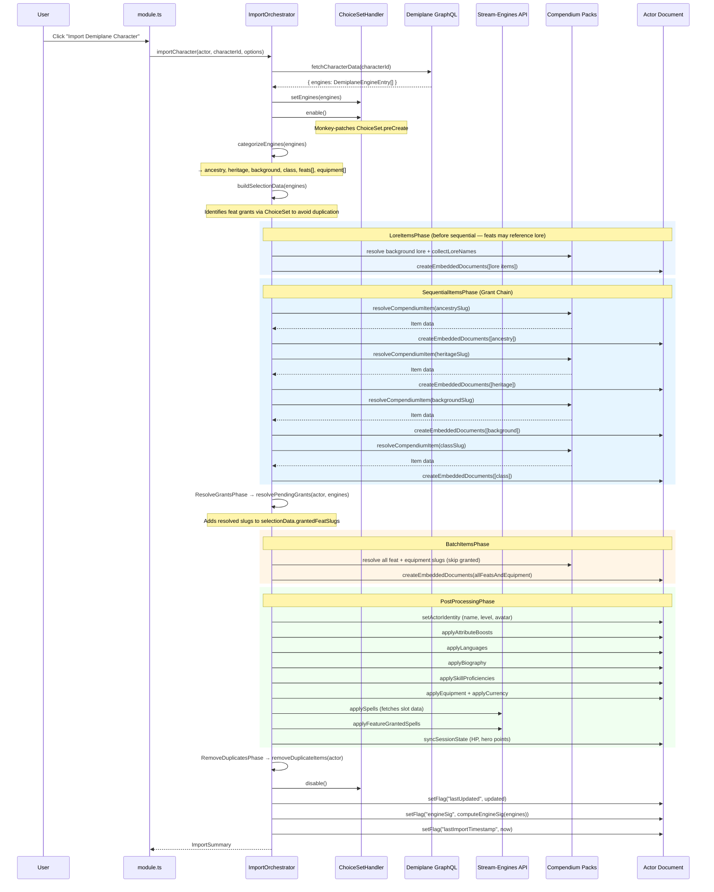

# `import` package (driver)

Demiplane → Foundry character import. The driver layer
(`orchestrator.ts`, `phases.ts`, `reconcile.ts`, `variant-check.ts`) lives
at this root; domain logic lives in the sub-packages below, each with its
own `DESIGN.md`. The driver is the only part that fans out to all of them
(enforced by the `import-driver-depends-inward` and per-sub-package rules).

Sub-packages and their layering:

| Sub-package  | Responsibility                                             | May depend on                       |
| ------------ | ---------------------------------------------------------- | ----------------------------------- |
| `shared/`    | Compendium resolution, engine-stream reading, rank helpers | `core`, `mapping`                   |
| `character/` | Biography, attributes, skills, languages                   | `core`, `shared`, `mapping`         |
| `choices/`   | ChoiceSet auto-resolution + per-actor overrides            | `core`, `shared`                    |
| `spells/`    | Spellcasting entries, slots, feature-granted spells        | `core`, `shared`                    |
| `equipment/` | Inventory, runes, containers, crafting formulas            | `core`, `shared`, `mapping`, `sync` |

## Responsibility

Fetch a character's engines, run them through the ordered phase pipeline,
and leave a fully-built actor plus an `ImportSummary` — while the
`ChoiceSetHandler` auto-resolves PF2e's interactive choices without user
input. See [ARCHITECTURE](../../../docs/ARCHITECTURE.md#import-subsystem-detail)
and [DESIGN §6–§12](../../../docs/DESIGN.md#6-sequential-createembeddeddocuments-for-core-items).

## Public surface

`index.ts` is authoritative (2 names). Everything else in this package is
reached through the sub-package barrels (`shared/`, `character/`,
`choices/`, `equipment/`, `spells/`), never through this one.

| From              | Role                                                            | Names                 |
| ----------------- | --------------------------------------------------------------- | --------------------- |
| `orchestrator.ts` | Fetch engines, install ChoiceSet handling, build + run pipeline | `ImportOrchestrator`  |
| `reconcile.ts`    | Actor-wipe step consumed by `flows/` before re-import           | `deleteImportedItems` |

Internal (not exported): `phases.ts` (`ImportPhase`, `ImportContext`,
and the seven phase implementations), `variant-check.ts` (orchestrator-only
helper).

## How it works

- `ImportOrchestrator.importCharacter` fetches engines, stamps the
  `lastUpdated`/`engineSig` baseline, installs the `ChoiceSetHandler`
  monkey-patch, and drives the phases in order inside `try/finally`:
  lore → equipment prep → sequential ABC/class → grant resolution → batch
  feats/equipment → post-processing (identity, profile, spells, session
  state) → duplicate removal — then uninstalls the patch and stamps
  `lastImportTimestamp`. Journals import last, needing no patch.
- Grant-chain ordering is the reason for sequential phases: class features
  must exist before ancestry/feat evaluation (see ARCHITECTURE "Grant
  Chain Sequencing").
- `deleteImportedItems` (used by `flows/` pre-import) removes only items
  stamped `imported`, preserving user-added homebrew (DESIGN §15).

## Constraints

- The driver may import domain sub-package barrels, `core`, `sync`, and
  `mapping`. Domain sub-packages may never import the driver or each other
  (except through `shared/`) — the phase pipeline is the only fan-out point.
- New importers go in the fitting sub-package and are called from
  `phases.ts`, not from the orchestrator directly.

## Interactions

The driver fans out to the domain sub-packages; domains reach sideways
only through `shared/`:

### Driver-to-domain interactions

File-level graph behind the driver view above — which resolver serves
which domain:

### Grant-chain ordering

Why ABC/class creation is sequential while everything else batches:

### Import data flow detail

Phase-by-phase sequence behind the package-level flow in
[ARCHITECTURE](../../../docs/ARCHITECTURE.md#import-data-flow):

