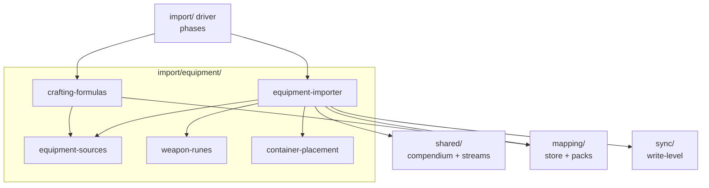

# `import/equipment` sub-package

Equipment import: inventory items, runes, container placement, carried
spells, currency, and crafting formulas. Depends on `core`, `shared`,
`mapping`, and `sync` (write gating) — always via their barrels (enforced
by `import-equipment-depends-inward`). See
[DESIGN §10](../../../docs/DESIGN.md#10-equipment-container-hierarchy).

## Responsibility

Turn item engines into Foundry inventory with correct containers, runes,
carry state, currency, and known formulas — skipping player-granted
duplicates the system's own GrantItems already create, and skipping
formula engines (which route to `system.crafting.formulas`, not inventory).

## Public surface

`index.ts` is authoritative (4 names). The driver needs only the
apply-steps:

| From                    | Role                                        | Names                                                     |
| ----------------------- | ------------------------------------------- | --------------------------------------------------------- |
| `equipment-importer.ts` | Items + containers + carry state + currency | `applyEquipment`, `applyCurrency`, `resizeActorEquipment` |
| `crafting-formulas.ts`  | Formula engines → crafting-formula UUIDs    | `applyCraftingFormulas`                                   |

Internal (not exported): `equipment-sources.ts` (equipment compendium
sources + `findBySlug`/`loadEquipmentSources`), `weapon-runes.ts` (rune
derivation/validation), `container-placement.ts` (stow resolution).

## How it works

- Granted-by-element engines (ancestry/feat-granted items Foundry's own
  rule elements already add) are skipped via `isGrantedByElement`, so
  importing never duplicates them; formula engines are routed to crafting
  formulas via `isFormulaEngine`.
- Containers are created first, then items are placed by stowed-status;
  runes attach through the rune helpers; currency applies to the actor.
  Compendium matching (including equipment-slug normalization for ranked
  scrolls/wands and specialty names) goes through `shared/` and the
  `mapping/` store, so GM overrides apply here like everywhere else.
- The `sync/write-level.ts` gate decides whether inventory writes happen
  at all — this package never reads the setting directly.

## Constraints

- May additionally use `mapping` (resolution) and `sync` (write gating)
  — the only domain sub-package with both edges. No imports from sibling
  sub-packages, the driver, `export/`, or `ui/`.

## Interactions

The importer fans into sources, runes, and placement; formulas share the
sources; resolution and gating come from outside:

